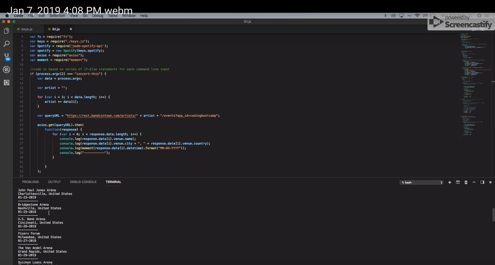

# liri-node-app-bot

## Introduction
Hello! Liri-node-app is a command line node application that grabs user input and returns API data relevant to the input. My goal with this project was to better understand how to use the node command line, parse user input and perform axios API calls to receive and display data. Because this is a CLI application, it cannot be deployed through Github or Heroku, so I have included a video demonstrating the app. Link as well as screenshot are below.

https://drive.google.com/file/d/17pLkHpG4dtey6BqI2BWSirqacAe6Lg34/view

Please read on for more information!

## Technologies
Node.js - JavaScript if/else statements, loops and module import 
.env 
FS node module 
Axios node package 
OMDB Movie Database API 
Spotify API and node package 
BandsInTown API 
Moment.js node package

## Methodology 
The general principle applied in this project was grabbing user input and using that as a query for various api calls. For example, if the user typed "concert-this" as their first input, followed by a band name, the program read the first input as direction to use the BandsInTown API and query the band name the user entered. Once the JSON object was returned, the data was parsed and displayed to the user in the terminal. Also, for the final part of the assignment "do-what-it-says", the program uses the fs module to read the data from a local file, parses it and inputs it in a query to an API. This project served as a great start to Node.js and backend development.

Please reach out with any questions!
